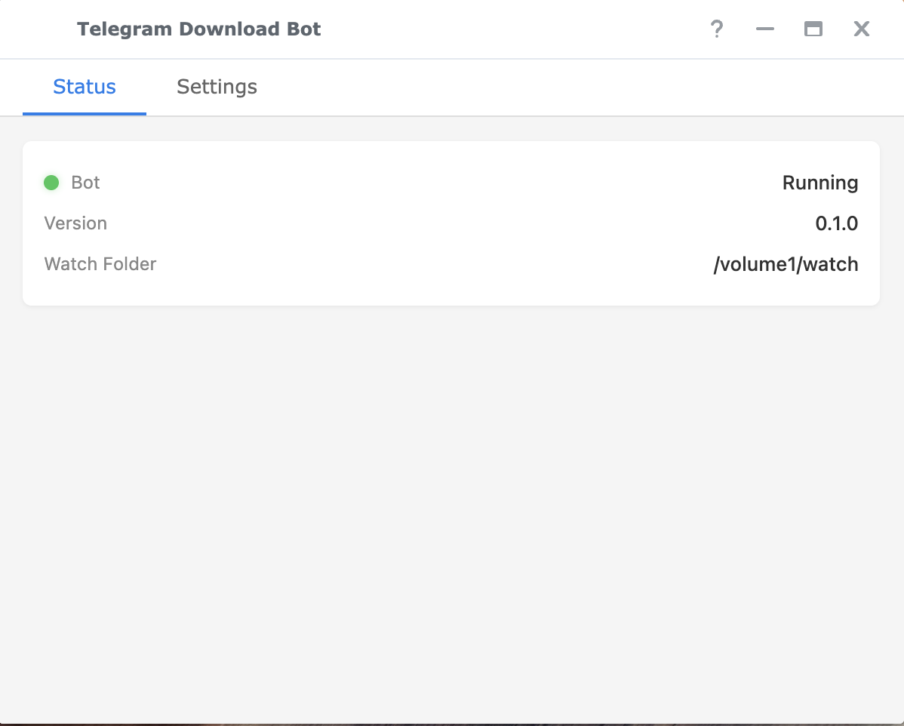
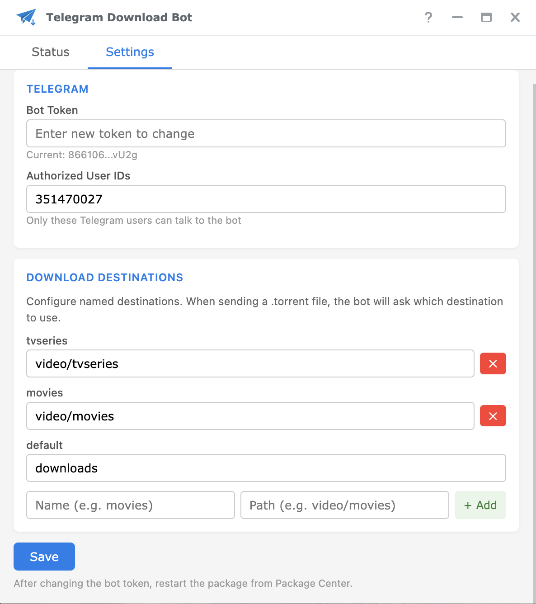

<p align="center">
  
</p>

# Synology Download Center Telegram Bot

A Telegram bot for Synology NAS that lets you send `.torrent` files from Telegram to start downloads via Download Station — with destination folder selection, download status, and completion notifications. Packaged as a native Synology SPK with a DSM-integrated settings UI.

Tested on **Synology DS223** (RTD1619B), but should work on any ARM64-based Synology NAS running DSM 7.0+.

## Screenshots

| Status | Settings |
|--------|----------|
|  |  |

## Features

- **Send `.torrent` files** from Telegram with destination folder selection (movies, tvseries, etc.)
- **Download status** — `/status` shows active downloads with progress and speed
- **Completion notifications** — get a Telegram message when downloads finish
- **Native DSM app** — configure the bot from DSM's desktop menu
- **One-click setup** — "Setup Bot Access" button creates a service account automatically
- **No credentials stored** — uses a service account with Download Station permissions only
- **RAM-backed UI bridge** — status communication via tmpfs, HDD can sleep

## How It Works

1. You send a `.torrent` file to your Telegram bot
2. The bot asks which destination folder to use
3. Download Station starts the download in the chosen folder
4. You get a Telegram notification when it completes

The bot uses a hybrid approach: torrents are added via Download Station's watch folder (for reliable BT processing), while status monitoring and notifications use the DSM API through an automatically-created service account.

## Setup

### 1. Create a Telegram Bot

1. Open Telegram and message [@BotFather](https://t.me/BotFather)
2. Send `/newbot`
3. Choose a display name (e.g. "My NAS Downloads")
4. Choose a username ending in `bot` (e.g. `my_nas_dl_bot`)
5. BotFather will reply with a **bot token** — save it for the next step

### 2. Find Your Telegram User ID

Message [@userinfobot](https://t.me/userinfobot) on Telegram. It will reply with your numeric user ID.

### 3. Configure Download Station

1. Open **Download Station** on your NAS
2. Go to **Settings** (gear icon)
3. Under **BT** tab, check **"Enable auto download"**
4. Set the **auto-download folder** to `/volume1/watch`
5. Under **General** tab, set your preferred **default destination folder**
6. Click **Apply**

### 4. Install the Package

1. Download the `.spk` file from [Releases](https://github.com/dmitryduka/synology-download-center-telegram-bot/releases)
2. Open **Package Center** on your NAS
3. Click **Manual Install** and upload the `.spk` file
4. The installation wizard will ask for your Telegram bot token, user ID, and watch folder path
5. Start the package

### 5. Setup Bot Access

1. Open **"Telegram Download Bot"** from the DSM main menu
2. Click **"Setup Bot Access"** — this automatically creates a service account with Download Station permissions
3. Grant the service account **read/write access** to your shared folders (Control Panel → Shared Folder → Permissions)

### 6. Configure Destinations

In the DSM app's **Settings** tab, add named destinations:
- `movies` → `video/movies`
- `tvseries` → `video/tvseries`
- `default` → `downloads`

These appear as buttons when you send a torrent to the bot.

## Telegram Commands

- `/status` — Active downloads with progress
- `/all` — All downloads including finished
- `/help` — Show available commands

Send a `.torrent` file and tap a destination button to start downloading.

## Building from Source

### Requirements

- **Rust** (stable, 1.70+) — [Install via rustup](https://rustup.rs/)
- **Zig** — needed for cross-compilation (`brew install zig` on macOS)
- **cargo-zigbuild** — `cargo install cargo-zigbuild`
- **Rust target** — `rustup target add aarch64-unknown-linux-musl`
- **Node.js** and **npm** — for building the DSM UI components

### Build

```bash
make spk
```

This will:
1. Cross-compile the Rust binary for `aarch64-unknown-linux-musl`
2. Build the Vue.js DSM native app with webpack
3. Assemble the `.spk` package

### Deploy to NAS

```bash
make install NAS_HOST=192.168.1.100 NAS_USER=admin
```

### Project Structure

```
src/                      Rust source code
  main.rs                 Entry point, tmpfs bridge setup
  config.rs               TOML configuration with destinations
  web.rs                  tmpfs bridge for DSM UI communication
  notifier.rs             Background poller for download notifications
  synology/
    dsm_api.rs            DSM HTTP API client (auth, task list, edit, control)
    watcher.rs            Watch folder torrent dropper
  telegram/
    bot.rs                Telegram bot setup with command menu
    handlers.rs           Message/callback handlers with destination selection
ui/                       DSM native Vue.js app
  src/main.js             SYNO.namespace entry point
  src/App.vue             App shell with tabs
  src/api.js              DSM API calls + service account setup
  src/components/         Status panel (with Setup button) and Settings form
  config                  DSM app descriptor
spk/                      Synology package files
  INFO                    Package metadata
  conf/                   Privilege and resource config
  scripts/                Lifecycle scripts
  WIZARD_UIFILES/         Installation wizard
```

## License

[MIT](LICENSE)
